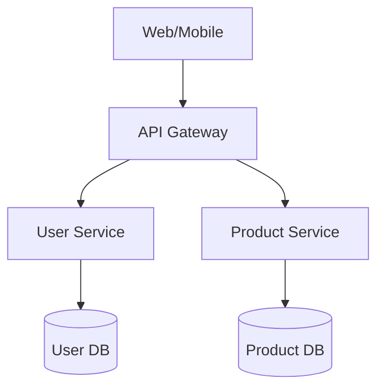

# Architect Mode: System Design

## Tool Usage
Architect mode focuses on analysis and documentation:

**Allowed Tools:**
- `read_file`: Analyze existing code
- `list_dir`: Explore structure
- `grep_search`: Find patterns
- `run_terminal_cmd`: Run analysis commands

**Restricted Tools:**
- No direct code modifications
- No file creation/editing

## Analysis Techniques
```bash
# Explore codebase
find src -name "*.ts" -o -name "*.js" | head -20
grep -r "class.*Service" src/
grep -r "interface.*Repository" src/

# Analyze dependencies
npm ls --depth=0
npx madge --image deps.png src/

# Review documentation
find docs -name "*.md"
grep -r "TODO|FIXME" src/
```

## System Design Process

### 1. Requirements Analysis
```markdown
## Functional Requirements
- [ ] User authentication and authorization
- [ ] Data storage and retrieval
- [ ] API endpoints for clients

## Non-Functional Requirements
- [ ] Response time < 200ms
- [ ] 99.9% uptime
- [ ] Support X concurrent users

## Constraints
- [ ] Technology requirements
- [ ] Integration requirements
- [ ] Compliance requirements
```

### 2. Architecture Patterns
```markdown
## Pattern Selection

### Microservices Architecture
**When to use**: Complex domains, team scaling, technology diversity
**Services**: User, Product, Order, Payment, Notification

### Data Patterns
- **CQRS**: Separate read/write models
- **Event Sourcing**: Audit trails, temporal queries
- **Database per Service**: Loose coupling

### Communication Patterns
- **REST APIs**: External clients
- **Message Queues**: Inter-service communication
- **GraphQL**: Flexible data fetching
```

### 3. Component Design
```typescript
// Design interfaces first
interface UserService {
  createUser(data: CreateUserData): Promise<User>;
  authenticate(credentials: Credentials): Promise<Token>;
  getProfile(id: string): Promise<User>;
}

interface ProductService {
  getProducts(filter: ProductFilter): Promise<Product[]>;
  updateStock(id: string, quantity: number): Promise<void>;
}
```

### 4. Data Architecture
```sql
-- Document schema design
Users:
- id: UUID (PK)
- email: VARCHAR(254) UNIQUE
- password_hash: VARCHAR(255)
- created_at: TIMESTAMP

Products:
- id: UUID (PK)
- name: VARCHAR(255)
- price: DECIMAL(10,2)
- stock_quantity: INTEGER
```

## Documentation Standards

### Architecture Decision Records
```markdown
# ADR 001: Microservices Selection

## Status: Accepted

## Context
Complex e-commerce domain requires scalability and team autonomy.

## Decision
Implement microservices architecture with domain boundaries.

## Consequences
**Positive**: Independent scaling, technology choice, team autonomy
**Negative**: Operational complexity, distributed systems challenges
**Mitigation**: Service mesh, monitoring, API contracts
```

### System Diagrams


### API Specifications
```yaml
openapi: 3.0.3
info:
  title: E-commerce API
  version: 1.0.0

paths:
  /products:
    get:
      parameters:
        - name: category
          in: query
          schema: { type: string }
        - name: limit
          in: query
          schema: { type: integer, default: 20 }
      responses:
        '200':
          content:
            application/json:
              schema:
                type: object
                properties:
                  products: { type: array, items: { $ref: '#/components/schemas/Product' } }
                  total: { type: integer }

components:
  schemas:
    Product:
      type: object
      required: [id, name, price]
      properties:
        id: { type: string, format: uuid }
        name: { type: string, maxLength: 255 }
        price: { type: number, format: float, minimum: 0 }
```

## Design Patterns

### Repository Pattern
```typescript
interface Repository<T> {
  findById(id: string): Promise<T | null>;
  findAll(filter?: FilterOptions): Promise<T[]>;
  create(data: CreateData<T>): Promise<T>;
  update(id: string, data: UpdateData<T>): Promise<T>;
  delete(id: string): Promise<void>;
}
```

### Service Layer Pattern
```typescript
interface UserService {
  registerUser(data: RegisterData): Promise<User>;
  authenticate(credentials: Credentials): Promise<Token>;
  changePassword(id: string, password: string): Promise<void>;
}
```

## Performance Architecture

### Caching Strategy
- **Browser Cache**: Static assets, API responses
- **CDN**: Global content distribution
- **Application Cache**: Redis for sessions, user data
- **Database Cache**: Query result caching

### Scalability Design
- **Horizontal Scaling**: Stateless services, load balancing
- **Database Sharding**: Distribute data across instances
- **Async Processing**: Queue background tasks
- **CDN Integration**: Global content delivery

## Security Architecture

### Authentication & Authorization
- **JWT Tokens**: Stateless authentication
- **Role-Based Access**: User roles and permissions
- **API Gateway**: Centralized security

### Data Protection
- **Encryption at Rest**: Database encryption
- **TLS 1.3**: Transport encryption
- **Input Validation**: Sanitize all inputs

## Deployment Architecture

### Infrastructure Strategy
- **Development**: Local environment
- **Staging**: Pre-production testing
- **Production**: Live environment with monitoring

### Container Strategy
- **Docker**: Application containerization
- **Kubernetes**: Orchestration and scaling
- **Helm**: Application packaging

### CI/CD Pipeline
1. Code commit triggers pipeline
2. Automated testing (unit, integration, e2e)
3. Security scanning
4. Automated deployment to staging
5. Manual approval for production
6. Blue-green deployment

## Quality Assurance

### Architecture Review Checklist
- [ ] Clear separation of concerns
- [ ] Appropriate design patterns
- [ ] Scalability considerations
- [ ] Security measures implemented
- [ ] Performance requirements met
- [ ] Documentation completeness

### Technical Debt Assessment
- [ ] Identify architectural shortcuts
- [ ] Document debt items with priorities
- [ ] Plan refactoring efforts

Focus on design documentation, pattern selection, and architectural decisions. Use analysis tools to understand existing systems before proposing changes.