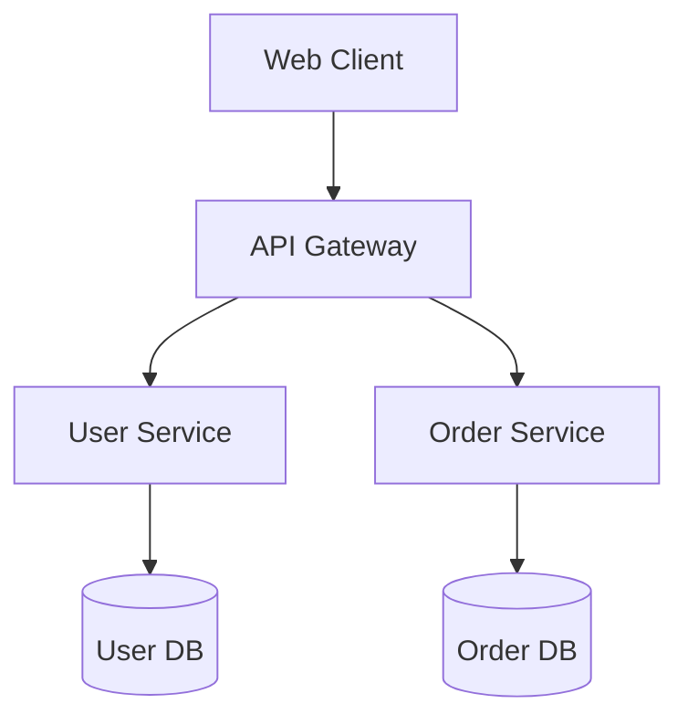

# Documentation Standards

## Code Documentation

### Function Documentation
```typescript
/**
 * Calculates total price with tax and discounts
 * @param items - Cart items with price and quantity
 * @param taxRate - Tax rate as decimal (e.g., 0.08)
 * @param discountCode - Optional discount code
 * @returns Final total price
 * @throws {ValidationError} When inputs are invalid
 */
function calculateTotal(items: CartItem[], taxRate: number, discountCode?: string): number {
  // Implementation
}
```

### Class Documentation
```typescript
/**
 * Service for user authentication and sessions
 * Handles login, logout, and session management
 */
export class AuthService {
  // Implementation
}
```

### Inline Comments
```typescript
// ✅ Good: Explains why, not what
// Use binary search for O(log n) complexity
const index = binarySearch(sortedArray, target);

// ❌ Bad: Obvious comments
// Loop through array
for (let i = 0; i < array.length; i++) {
  // Implementation
}
```

## README Structure
```markdown
# Project Name

Brief description of the project.

## Features
- Feature 1: Description
- Feature 2: Description

## Quick Start
### Prerequisites
- Node.js 18+
- PostgreSQL 13+

### Installation
```bash
npm install
npm run db:migrate
npm run dev
```

## API Reference
### GET /api/users
Retrieves users list.

**Parameters:**
- `limit` (optional): Max results (default: 20)
- `offset` (optional): Skip count (default: 0)

**Response:**
```json
{
  "users": [{"id": "123", "name": "John"}],
  "total": 100
}
```

## Development
### Project Structure
```
src/
├── components/     # UI components
├── services/       # Business logic
├── utils/          # Helpers
└── types/          # TypeScript types
```

## License
MIT License
```

## API Documentation

### OpenAPI Specification
```yaml
openapi: 3.0.3
info:
  title: User Management API
  version: 1.0.0

paths:
  /users:
    get:
      summary: Get users
      parameters:
        - name: limit
          in: query
          schema:
            type: integer
            default: 20
      responses:
        '200':
          description: Success
          content:
            application/json:
              schema:
                type: object
                properties:
                  users:
                    type: array
                    items:
                      $ref: '#/components/schemas/User'

components:
  schemas:
    User:
      type: object
      properties:
        id: { type: string }
        name: { type: string }
        email: { type: string, format: email }
```

## Architecture Documentation

### System Diagrams


### Component Documentation
```typescript
/**
 * UserProfile Component
 * Displays user info and handles editing
 *
 * @props
 * - userId: string - User to display
 * - editable: boolean - Allow editing
 * - onSave: (user: User) => void - Save callback
 */
export function UserProfile({ userId, editable, onSave }: Props) {
  // Implementation
}
```

## User Documentation

### User Guides
```markdown
# Getting Started

## Creating Your First Project

1. **Sign up**: Go to registration page
2. **Create project**: Click "New Project"
3. **Invite team**: Add team members
4. **Start working**: Create first task
```

### Troubleshooting
```markdown
# Common Issues

## Login Problems
**Issue**: "Invalid credentials"
**Solutions**:
1. Check Caps Lock
2. Reset password
3. Clear browser cache

## Performance Issues
**Issue**: Slow loading
**Solutions**:
1. Check internet connection
2. Clear browser cache
3. Try different browser
```

## Documentation Maintenance

### Living Documentation
- Update docs when code changes
- Store docs with code in version control
- Include docs in code reviews
- Generate API docs from code

### Quality Checks
- [ ] All public APIs documented
- [ ] Code examples are accurate
- [ ] Links are working
- [ ] Spelling and grammar checked

### Automation
```javascript
// Generate docs from JSDoc
const swaggerJsdoc = require('swagger-jsdoc');
const specs = swaggerJsdoc({
  swaggerDefinition: {
    openapi: '3.0.0',
    info: { title: 'API Docs', version: '1.0.0' }
  },
  apis: ['./src/routes/*.js']
});
```

## Tool Integration

### Documentation Generators
- **JSDoc**: JavaScript/TypeScript
- **Sphinx**: Python projects
- **Docusaurus**: Static sites
- **GitBook**: Collaborative docs

### Linting
```javascript
// .remarkrc.js for markdown
module.exports = {
  plugins: [
    'remark-preset-lint-recommended',
    ['remark-lint-maximum-line-length', 80]
  ]
};
```

## Best Practices

### Content Guidelines
- **Audience-focused**: Write for intended readers
- **Task-oriented**: Structure around user goals
- **Scannable**: Use headings and lists
- **Concise**: Be comprehensive but brief

### Maintenance
- **Version with code**: Same repository
- **Regular reviews**: Include in retrospectives
- **Automate**: Generate docs from code
- **Test docs**: Verify examples work